# Review final

Muy buen trabajo Pabla, has conseguido lo que buscabas con el theme mode y te ha queda muy bien. Te paso algo de feedback para que continues mejorándolo y una reflexión final por si quieres seguir profundizando en front.

Te falta la etiqueta de apertura del `<html>` en todas las páginas, y por lo tanto también el atributo del idioma

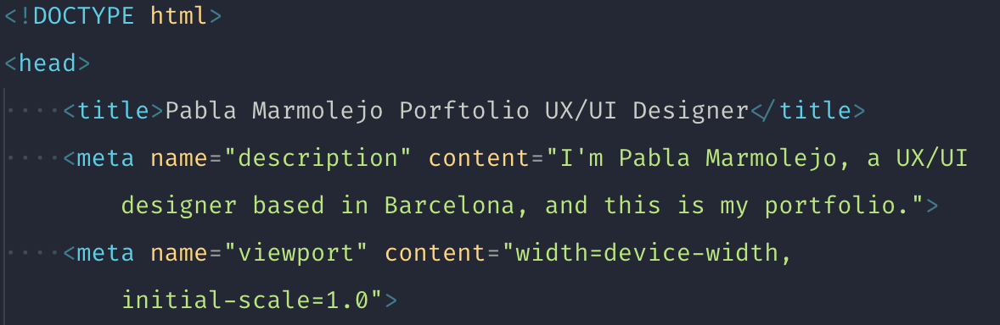;
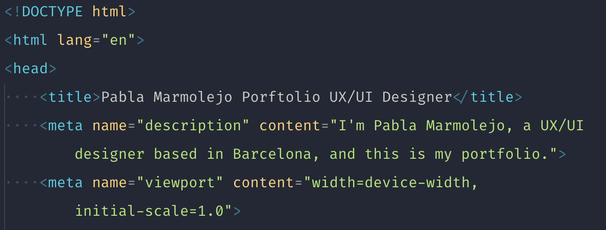;

He visto por ahí algún elemento escondido, lo que se suele llamar _easter egg_, pero no veo que exista esa página. En un lector de pantalla ese link es "visible" y por lo tanto también para los crawlers de los buscadores, por lo que se considera una 404 (Página no encontrada). Y también tienes estos links en las páginas de proyecto

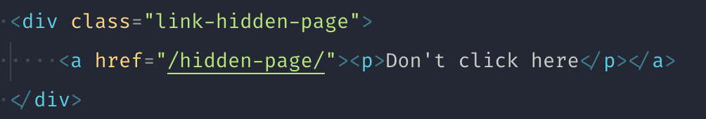

En móvil, se rompe la página por culpa del email del footer, que su contenido fuerza el scroll. Puedes solucionarlo haciéndolo más pequeño o que caiga a 2 líneas

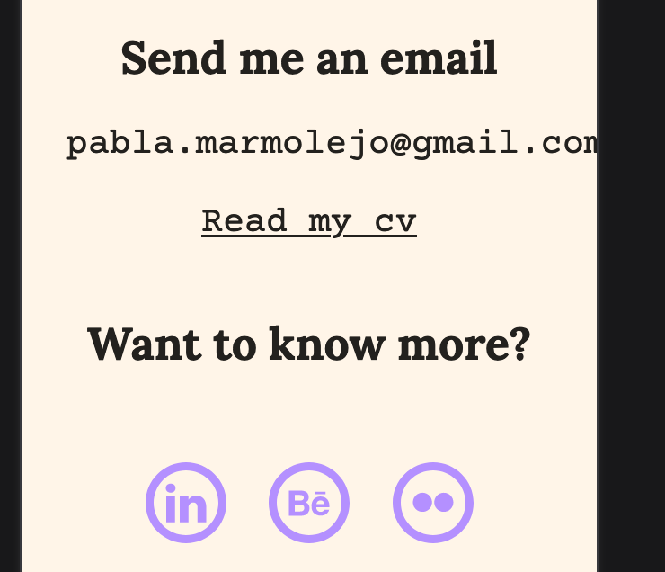

En móvil pequeño (iphone 5S), también se rompe el switch que cambia el modo (dark/light). El problema es un `translate: transformX` que debería ser diferente en ese breakpoint

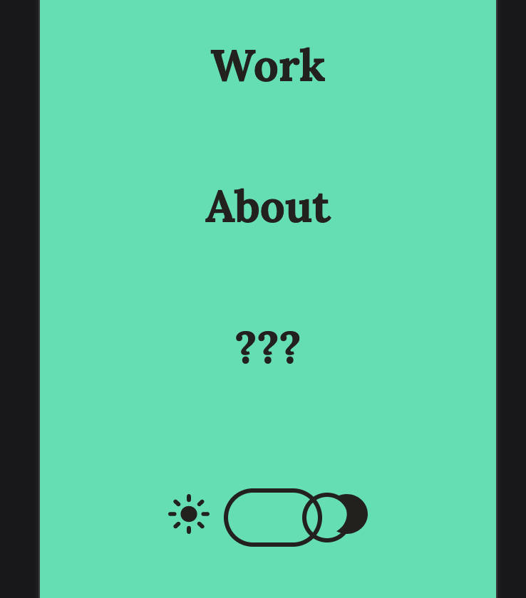

Tienes un link que tiene el texto `???`, entiendo que es temporal, pero te recomiendo modificarlo para que sea más accesible. Lo recomendable es ocultar ese texto a un lector de pantalla `aria-hidden` y ofrecerce una opción más legible `aria-label`

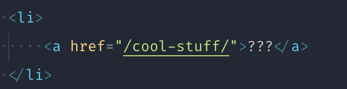
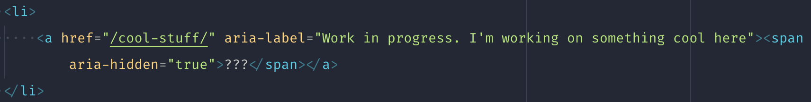

Ten en cuenta que los links externos deberían ir con `target="_blank"` y con el atributo `rel` correspondiente. No es recomendable quitar al usuario la pestaña de tu página, es mejor que siga consumiendo tu contenido. E intenta eliminar siempre los atributos `width` y `height` de los svg en favor del `viewBox`, que ayuda a hacer los svg responsive.

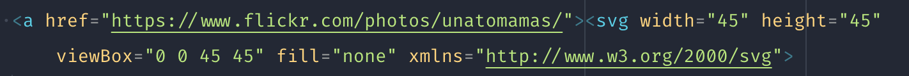
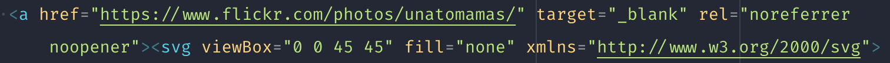

En cuanto al Javascript, la solución no está mal, pero yo siempre recomiendo delegar las funcionalidades de Javascript al lenguaje y/o archivo correspondiente. Ahora ejecutas funciones en el atributo `onclick` de HTML, no está mal, pero en páginas estáticas lo mejor es delegarlo al archivo `.js` de esa manera el mantenimiento se hace más sencillo, solo tienes que modificar un solo archivo.

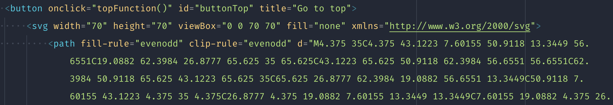
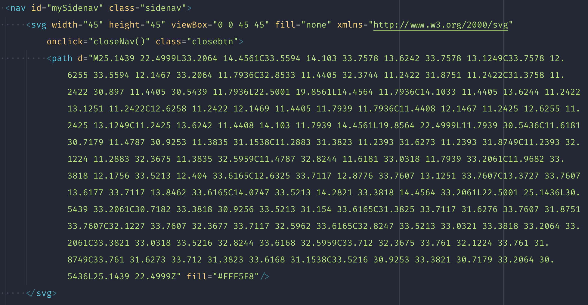

**Solución:**

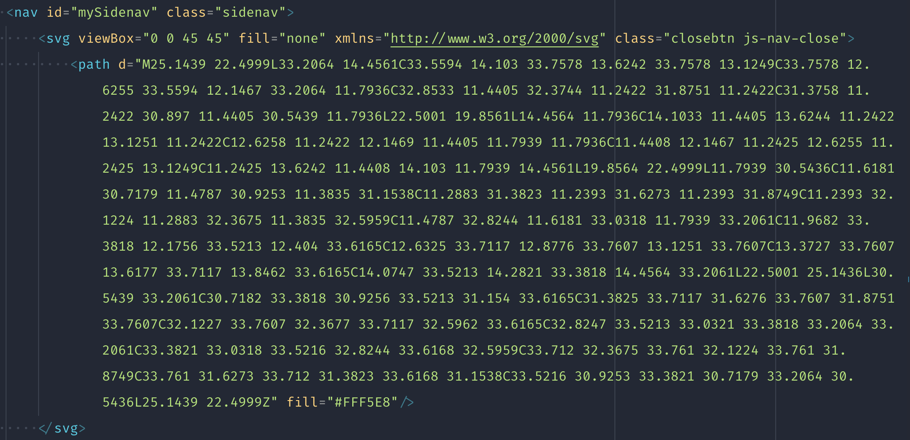
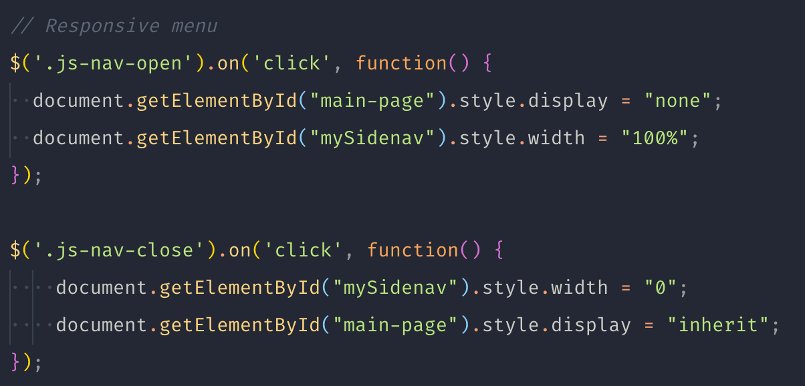

En cuanto a continuar tu formación, hay muchos frameworks que se utilizan actualmente para desarrollar páginas web y que facilitan la reutilización de componentes y mejoran la velocidad de carga de tu web, pero que tienen una curva de aprendizaje elevada. Especialemente si no estás tan acostumbrada al entorno Javascript, ya que todo ronda entorno a este lenguaje, incluído el HTML y CSS, pero que se hace un poco más sencillo gracias a plugins y algunos build-ins que tienen estos frameworks.

Todo se trabaja con el Terminal, por lo cual necesitarás acostumbrarte a ello también. En Mac tienes la opción de la app "Terminal" nativa de Mac o instalar [iterm](https://iterm2.com/) que es mejor.

En cuanto a frameworks tienes 2 que son los más utilizados actualmente:

- [React](https://es.reactjs.org/)
- [Vue](https://vuejs.org/)

Ambos están muy bien y se utilizan bastante, pero React sigue llevando la delantera en general. Además con React puedes utilizar [Gatsby](https://www.gatsbyjs.com) que es un generador de páginas estáticas, que por defecto te brinda muchas opciones y facilidades para crear, por ejemplo, un blog solamente escribiendo en Markdown (como este archivo).

Si estas interesada, [Gatsby tiene un tutorial muy didáctico](https://www.gatsbyjs.com/docs/tutorial/) para que empieces desde cero, incluso con el Terminal y publicando una página en su Cloud, algo similar a lo que vimos con Netlify. Dime si estás interesada en utilizar esta herramienta y, a medida que vayas avanzando y tengas dudas, me ofrezco para darte ayuda.

O si prefieres continuar ahondando en lo que hicimos en clase, o avanzar en Javascript, como ya os dije, tienes mi mail por si necesitas ayuda.
